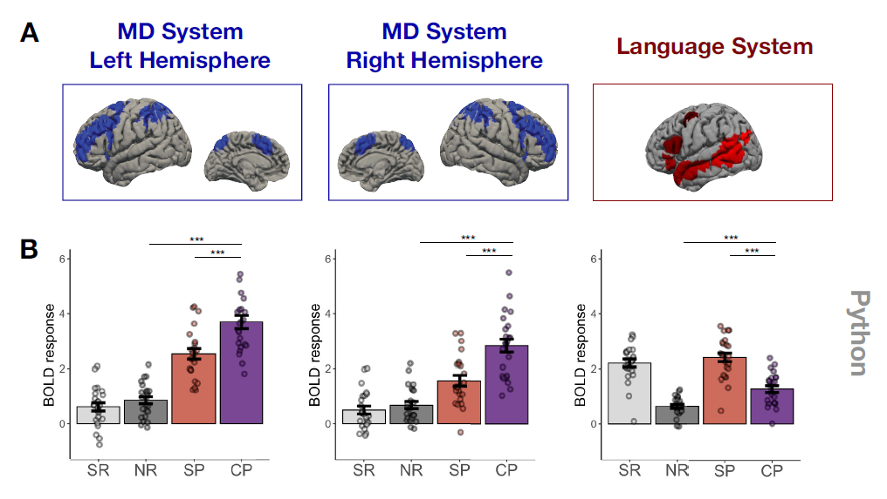
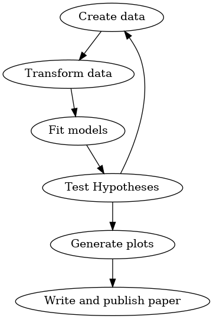
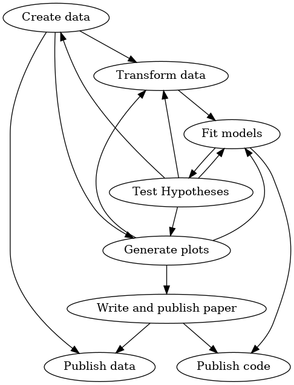
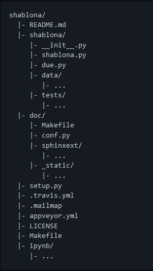

% Intro
% Programming good research code good
% Patrick Mineault

# 

Intro

# Who is this lecture for?


# Who is this lecture for?

* Most people who do coding-heavy research are not trained in CS or software engineering
* You're probably in this bucket
* Bad consequences:
    * You feel like you don't know what you're doing
    * Imposter syndrome
    * Low productivity
    * Bugs
    * You hate your code and you don't want to work on it
    * You never graduate
    * You have great sadness in your heart
* It doesn't have to be all bad!

# My weird perspective

* Patrick Mineault, PhD in neuroscience
* (wildly underqualified) software engineer at Google
* Research scientist at Facebook on brain-computer interfaces
* Technical chair of Neuromatch Academy
* Occasionally taught CS
* Independent researcher and technologist

# Regrets, I've had a few

* Mostly self-taught in programming
* Didn't study CS until very late
* Wasted months working with bad code of my own making
* Wasn't until I joined Google that I became gooder at code
* I stand on the shoulders of giants who showed me the error of my ways
* Not a great coder, but better than in grad school
* I think you might be curious

# Organization

* Assume that you know a little bit about Python, git and the command line
  * If you don't, that's ok! This is vertically integrated advice. Get inspired, follow more detailed tutorials after, and come back to this.
* 5 easy steps to better code
  * Concrete examples
  * Interactive sessions (zoom chat)
  * 5-minute action items
  * Everybody leaves having learned an actionable thing 
* Roadmap to self-improvement & extra resources
* But first, I will indulge in theory...

# Thesis

Writing good research code boils down to saving your memory - both working and long-term.

# Coding is very working-memory intensive



# Coding is very working-memory intensive

* MD: Multiple-demand system
* CP: code programming
* SP: sentence programming
* SR: sentence reading
* NR: non-word reading

# Research code is very LTM-intensive

{height=250px}

# Research code is very LTM-intensive

{height=250px}

# Research code

- Endpoint is unclear
- Correct can be hard to define
- Lots of exploration and dead ends
- Sometimes, there are manual steps involving human judgement
- You have to remember all the dead ends for the code to even make sense

# Consequence

You will get [overloaded](https://imgur.com/gallery/UNhWQiV).

# Principle 1: conserve your WM

- Reduce the cognitive load of understanding your code
- [Simple is better than complex. Complex is better than complicated.](https://zen-of-python.info/simple-is-better-than-complex.html#3)

# Principle 2: write for your future self in mind

- Future you will have forgotten 90% of what you wrote
- Kernighan's Law - Debugging is twice as hard as writing the code in the first place. Therefore, if you write the code as cleverly as possible, you are, by definition, not smart enough to debug it.

---

# 

Practical Lessons

# Disclaimer: this is a low-judgement zone

- It's ok to write garbage code when you're in a rush
- It's not ok to keep building more and more on top of garbage code
    - sure, there's the moral imperative to create replicable code to bring forward the shining light of science and truth...
    - but also, do you want to scrap 6 months of research because you forgot to transpose a matrix?
    - you will get bitten back
- Guidelines not rules

# Lesson 1: keep things tidy


# What needs to be tidy

* Project folder structure
* Code style
* Notebooks
* Prereq: Git & Github: if you're going to keep things clean, you will mess up and need a time machine.

# Project folder structure

* Consensus: one repo = one project $\approx$ one paper
* Lots of templates around:
  * [Turing Way](https://the-turing-way.netlify.app/reproducible-research/compendia.html#executable-compendium)
  * [Research Software Engineering with Python](https://merely-useful.github.io/py-rse/getting-started.html#getting-started-structure)
  * [Python package best practices](https://education.molssi.org/python-package-best-practices/01-package-setup/index.html)
  * [Shablona](https://github.com/uwescience/shablona)

# Shablona

{height=220px}

# Shablona

* Keeps docs, data, scripts and code tidy and in their own little box
* Is compatible with Python packaging. That means you can install locally with `pip install -e .`, and the code inside the special folder (placeholder: `shablona`) becomes a package `shablona`
* You can `import shablona` to access the code in the packages
* [Use as a template to start a new project via big green button](https://github.com/uwescience/shablona)
* Or build it from scratch to understand the moving pieces

# 

Live demo

# Packages, how do they work?

I can never remember how to setup a Python package from scratch, so I did it once here:

[https://github.com/patrickmineault/minimal-package](https://github.com/patrickmineault/minimal-package)

[Here is a long-form explanation about how packages really work (useful if you run into trouble)](../slides/notes/how_packages_work.md).

# Other conventions

- Notebooks → `Start with a Capital Letter.ipynb`
- Reusable functions and packages, etc. → `snake_case.py`
- Tests under `tests` folder

# Code style

* Use a consistent style
* [Python has a style guide - PEP8](https://www.google.com/search?channel=crow2&client=firefox-b-d&q=pep8). 
  * Indentation
  * Line length
  * Spaces
  * Variable names
  * imports
* [Orgs like Google have their even more pedantic style guides](https://google.github.io/styleguide/pyguide.html).
* There are linters which will catch style issues
  * flake8
  * pylint
* We'll talk more about the tools in the *use good tools* section.

# Comment style

* [Numpy style](https://sphinxcontrib-napoleon.readthedocs.io/en/latest/example_numpy.html) or [Google style](https://sphinxcontrib-napoleon.readthedocs.io/en/latest/example_google.html).

```{.python}
def my_doubler(x):
    """Doubles x.

    Args:
        x: the number to double

    Returns:
        Twice x
    """
    return x * 2
```

# IPython notebooks

> if you use notebooks to develop software, you are probably using the wrong tool. -- [Yihui Xie](https://yihui.org/en/2018/09/notebook-war/)

* Notebooks are hard to keep tidy because of nonlinear execution
* Restart and Run All is your friend
* It's ok to write plotting code in a notebook, but don't write real functions.
    * Disclaimer: I write real functions in notebooks all the time, and I know I shouldn't

# Aside: Swim test

Everything at Google is one giant monorepo with billions of lines of code ([https://cacm.acm.org/magazines/2016/7/204032-why-google-stores-billions-of-lines-of-code-in-a-single-repository/fulltext#FNE](https://cacm.acm.org/magazines/2016/7/204032-why-google-stores-billions-of-lines-of-code-in-a-single-repository/fulltext#FNE). By ~day 3, it was time to go do a code. Everything is organized according to strict [conventions](https://github.com/google/styleguide/blob/gh-pages/pyguide.md), so it's not that bad to jump in. 

# Lesson 1

* Keep things tidy
* Free your W&LTM from having to remember where stuff is
* Your 5-minute exercise: use the `shablona` template for a project

---