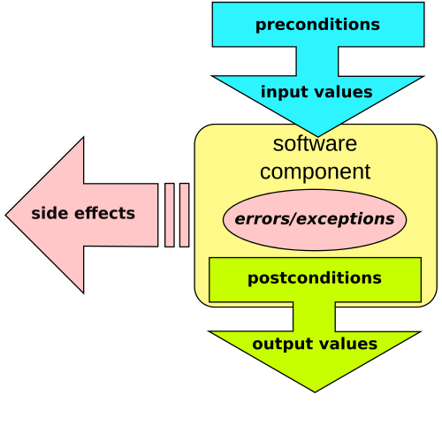

# Lesson 2

Keep things decoupled

# Spaghetti code

![e.g [^1]](../figures/spaghetti-code.png)

[^1] Brown et al. AntiPatterns, 1998

# Do you know when your code smells?

- Maybe your code is written in a way where you're doing a little bit of everything all at once
- e.g. `wave_clus`
    - very useful software to sort spikes
    - has a GUI in Matlab GUIDE
    - GUIDE makes it exceptionally hard to write good code
    - Picked it because it's real code

# Sample code

[Code here](https://github.com/csn-le/wave_clus/blob/master/wave_clus.m#L964).

# What's going here?

This is a callback for a function in a GUI for spike sorting.

- Does many things at once
    - Manipulates the GUI
    - Modifies data
    - Reads a jpg file?
- Uses magic numbers and magic columns
- Uses various string formatting functions and `exec`
- Big function
- Not complex, but it's complicated

# Tightly coupled

- When code is tightly coupled (does a lot of unrelated things at once) it becomes very hard to reason about.
- Let's say your results are weird, are they weird because...
    - the data is bad
    - you're loading the data wrong
    - your model is incorrectly implemented
    - your model is inappropriate for the data
    - you statistical tests are inappropriate for the data distribution
- Let's say you want to describe to someone what the bug is in your code

# Uncouple and simplify

- Keep each of the boxes separate with minimal interface
    - Separation of concerns:
        - example: your data loading function should just load data
        - Your computation functions shouldn't load data, they should just compute
- Make each of the boxes small
    - don't make giant monolithic functions
    - Make functions which are small
        - a screen's worth, 80 columns, 50 lines
- Avoid side effects, prefer pure functions


# What's a side effect?

> In computer science, an operation, function or expression is said to have a side effect if it modifies some state variable value(s) outside its local environment, that is to say has an observable effect besides returning a value (the main effect) to the invoker of the operation. State data updated "outside" of the operation may be maintained "inside" a stateful object or a wider stateful system within which the operation is performed. Example side effects include modifying a non-local variable, modifying a static local variable, modifying a mutable argument passed by reference, performing I/O or calling other side-effect functions. (Wikipedia)

# Side effects

{height=220px}

# A function with side effects

```{.python}
def reversi(arr):
    """Reverses a list."""
    for i in range(len(arr) // 2):
        arr[-i - 1] = arr[i]
    return arr
```

# Side effects

* Modifying arguments
* Printing
* Making API calls
* Changing globals

# Side effects are not the best

* Stuff happens outside of the normal flow from arguments → return value
* Need to know state of function to understand it
* Hard to test
* Let's box them

# Demo

* `fib.py`
* Fibonacci sequence, $F(n) = F(n-1) + F(n-2)$
* Memoization

# Learn more about your language

- Sometimes (but not always!), code smells come from lack of knowledge
    - E.g. using magic column numbers in a raw numpy array rather than named columns in pandas because you don't know pandas
    - Using unnamed dimensions in numpy rather than xarray
    - Using + and bespoke casting for string formatting rather than the one true solution, the f-string
- Take time to learn more about the language you use

# Enough theory!

Let's de-couple CKA!

# Centered kernel alignment


* [Kornblith et al. (2019)](https://arxiv.org/abs/1905.00414)
* Allows comparison of the representations of two systems, e.g. a brain and a deep neural net, or two deep neural nets

# Centered kernel alignment

* Same number of stimuli $n$, potentially different numbers of features
* Let's collect the responses of each system into matrices $\mathbf{X}, \mathbf{Y}$, each $n$ high. 
* Center $\mathbf{X}, \mathbf{Y}$ so each column has 0 mean, then:

$$CKA(\mathbf X, \mathbf Y) = \frac{||\mathbf X^T \mathbf Y||_2^2}{||\mathbf X^T \mathbf X||_2 ||\mathbf Y^T \mathbf Y||_2}$$

* Min 0, max 1
* Check: if $\mathbf{X}$ and $\mathbf{Y}$ are one-dimensional, then $CKA = \rho( \mathbf X, \mathbf Y)^2$.

# Live coding!


# Points from live coding example

* Often, analysis scripts have a clear flow from inputs to computation to outputs
* Put the controller in the `main` function, hide behind `__name__ == "__main__"`
    * Avoids module variables in Python
    * Makes the code importable
* Isolate the computation in its own function independent of IO

# Configuration

* Keep your configuration our of your code
* Use `argparse` to specify options via the command or `python-dotenv` to store secrets in a `.env` file.

# Lesson 2

* Keep things decoupled
* By keeping things decoupled, you can think about one part of your program at a time
* Save your WM slots
* Your 5-minute exercise: take existing piece of code and wrap it in main