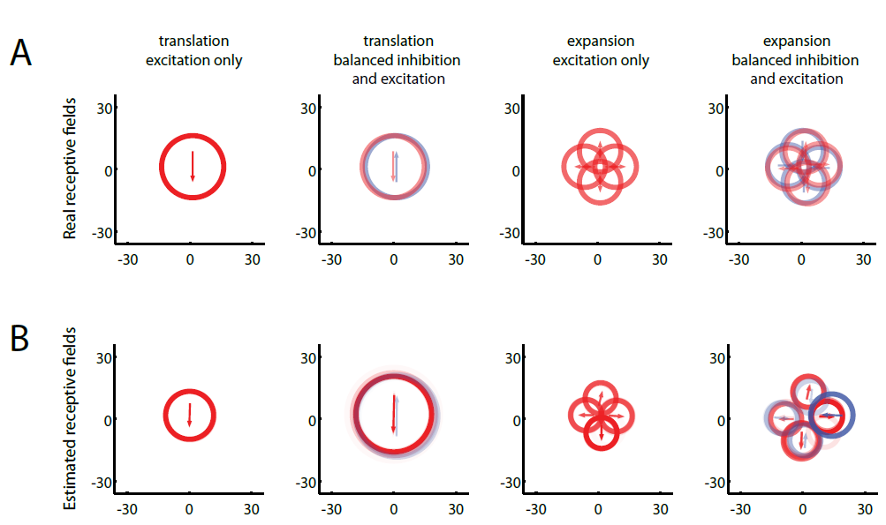
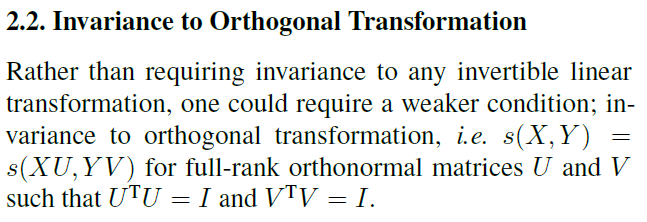

% Testing
% Programming good research code good
% Patrick Mineault

# Bulding around testing

> Most scientists who write software constantly test their code. That is, if you are a scientist writing software, I am sure that you have tried to see how well your code works by running every new function you write, examining the inputs and the outputs of the function, to see if the code runs properly (without error), and to see whether the results make sense. Automated code testing takes this informal practice, makes it formal, and automates it, so that you can make sure that your code does what it is supposed to do, even as you go about making changes around it. --Ariel Rokem, Shablona README

# Open discussion

* Let's test `fib.py`
* What can we test?

# What can we test about `fib`?

* Correctness, e.g. $F(4) = 5$
* Edge cases, e.g. $F(0) = 1$, $F(-1)$ → *error*
* Functional goals are achieved, e.g. caching works
* It's much easier to test decoupled code with no side effects
    * Forces you to write modular decoupled code

# How can you decide what to test?

* If something caused a bug, test it
    * 70% of bugs will be old bugs that keep reappearing
* If you manually checked if procedure X yielded something reasonable results, write a test for it.

# How can we test?

* `assert`
* Hide code behind `if __name__ == '__main__'`
* Test suite

# `assert`

* `assert` throws an error if the assertion is False

```assert -(7 // 2) == (-7 // 2)```

* Great for inline tests
  * e.g. check whether the shape of a matrix is correct after a permute op

# Hide code behind `if __name__ == '__main__'`

* Code behind `__name__ == '__main__'` is only run if you run the file as a script directly.
* Use this for lightweight tests in combination with `assert`.

```{.python}
if __name__ == '__main__':
    assert fib(4) == 5
```

# Use a test suite

* Create a specialized file of tests that runs with the help of a runner.
* There's `pytest` and `unittest`.
* I use `unittest` because that's what I learned, and it's built in.

# Basic template

```{.python}
# test_something.py
import unittest

class MyTest(unittest.TestCase):
    def sample_test(self):
        self.assertTrue(True)

if __name__ == '__main__':
    unittest.main()
```

# Run it

```{.shell}
$ python test_something.py
```

To run all tests within a directory:

```{.shell}
$ nosetests
```

# Live coding

Let's code up `fib.py` tests!

# Points from live coding example

* Paths!
    * Sometimes you can get away with hacking `sys.path`
    * Ideally, set up a package with `pip install -e .`
* There's a lot of cruft: no shame in copy and paste!

# A hierarchy of tests can be run with a runner

* Static tests (literally your editor parsing your code to figure if it will crash)
* Asserts
* Unit tests (what we just saw)
* Integration tests
* Smoke tests
* Regression tests
* E2E (literally a robot clicking buttons)

# Write lots of tiny unit tests that run very quickly

* Goal: each unit test should run in 1 ms.
* The faster you iterate, the more your WM.
    * If your test suite takes more than 5 seconds to run, you will be tempted to
    go do something else.

# Open discussion

Q: what do you think is the ratio of unit tests to real code in a real codebase?

# Open discussion

A: 1:1 to 3:1, but can be many, many times that in safety critical applications

e.g. the aviation standard DO-178C requires 100% code coverage at its third highest safety level (Level C).

# An integration test

- E.g. I write a spiffy function that fits a GLM with L1 regularization
- How do I test that?
    - I make up some test data
    - I run my model
    - It gives me the correct outputs

# An integration test

{height=220px}

# Demo

* Let's code CKA tests

# What we know about CKA

* Only makes sense if two matrices are the same size along the first dimension
* If $\mathbf{X}$ and $\mathbf{Y}$ are one-dimensional, then $CKA = \rho( \mathbf X, \mathbf Y)^2$.
* $CKA(\mathbf X, \mathbf X) = 1$

# What we know about CKA

* 2.1 _not_ invariant to non-isotropic scaling
* 2.2 invariant to rotations, $CKA(\alpha \mathbf{X U}, \beta \mathbf{Y V}) = CKA(\mathbf X, \mathbf Y)$

{height=85px}

* 2.3 invariant to isotropic scaling, $CKA(\alpha \mathbf X, \beta \mathbf Y) = CKA(\mathbf X, \mathbf Y)$

# Live coding


# Points from live coding example

* Your test code can be ugly, as long as it's functional!
* Define boundary conditions, pathological examples
    * Test that bad inputs indeed raise errors! Your code should yell when you feed it bad inputs.
* Lock in current behaviour for regression testing

# Refactoring with confidence

* Your code is ugly: time to refactor!
    1. Your code is ugly, tests pass
    2. Rewrite the code
    3. Your code is clean, tests don't pass
    4. Rewrite the code
    5. Iterate until tests pass again
* Much less stressful than without tests
* Focus on one test at a time with `python test_cka.py TestCka.test_same`
    * Don't forget to run the whole suite at the end!

# Advanced topics!

* Testing deterministic side-effect free computational code has a very high returns:effort ratio, but...
* [You can also test data loaders for correctness](https://github.com/patrickmineault/brain-scorer/blob/main/tests/test_pvc4_loader.py).
* [You can also test data for correctness](https://github.com/patrickmineault/phaco-meta/blob/master/read-data.R#L320)
* [You can also test notebooks for correctness](https://github.com/NeuromatchAcademy/course-content/blob/master/ci/verify_exercises.py#L56)
* [You can integrate your tests into Github](https://github.com/patrickmineault/research_code/runs/1647753165?check_suite_focus=true)
* [You can test stochastic functions](https://softwareengineering.stackexchange.com/questions/133047/unit-testing-of-inherently-random-non-deterministic-algorithms?rq=1)

# Lesson 3

* Test your code
* Free your WM from having to consider that a piece of code unrelated to the thing you care about is broken
* From lesson 1: much simpler to refactor code to make it tidy when you know you have a test scaffold which catch mistakes
* From lesson 2: you will have to decouple code to write tests
* Your 5-minute assignment: find a commented-out print statement in your code and replace it with `assert`
