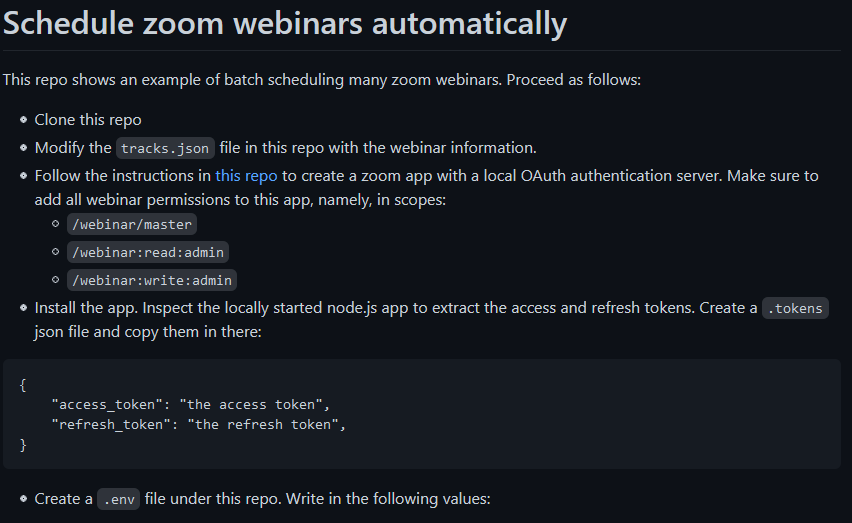
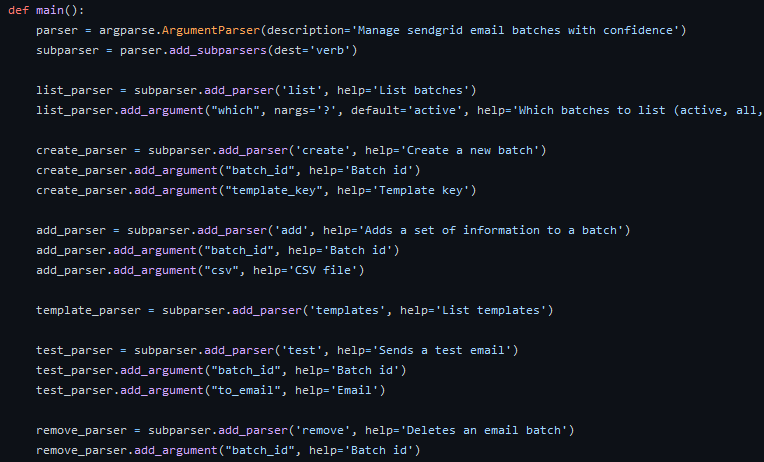

% Docs
% Programming good research code good
% Patrick Mineault

# Documentation

Write documentation

# 

You will forget about 90% of what you worked on. If you write it down, you'll be in a good spot.

# A word of warning

* I covered testing before documentation
* But why?

# Testing before documentation

* It's more important that your code works (is correct) than it is easy to use
* Docs become stale, tests have a long shelf life
* If tests run, you can always copy and paste code if you can't remember how to use the code
* Relatedly: if something can be a check, a warning or an exception, it should be

# Documented

```{.python}
def conv(A, B, padding='valid'):
    """
    Convolves the 1d signals A and B.

    Args:
        A: a 1d numpy array
        B: a 1d numpy array
        padding (str): padding type (valid, mirror)
    """
    pass
```

# Defensive inline checks

```{.python}
def conv(A, B, padding='none'):
    assert A.ndim == 1
    assert B.ndim == 1
    if padding not in ('valid', 'mirror'):
        raise NotImplementedError(f"{padding} not implemented.")
```

# What should you document?

* References to papers
* Why you wrote tricky code the way you did instead of the obvious way
* TODOs

```{.python}
# TODO(pmin): refactor this mess
```

* Usage, especially if other people will use your code.
* It's a gift from present you to future you

# How should we document functions?

* [Numpy style](https://sphinxcontrib-napoleon.readthedocs.io/en/latest/example_numpy.html) or [Google style](https://sphinxcontrib-napoleon.readthedocs.io/en/latest/example_google.html).

```{python}
def my_doubler(x):
    """Doubles x.

    Args:
        x: the number to double

    Returns:
        Twice x
    """
    return x * 2
```

# 

There are other many kinds of *documentation*

# `README.md`

{height=220px}

# Console usage

{height=220px}

# Console usage

```
(py3) $ python sendit.py
usage: sendit.py [-h] {list,create,add,templates,test,remove,send} ...

Manage sendgrid email batches with confidence

positional arguments:
  {list,create,add,templates,test,remove,send}
    list                List batches
    create              Create a new batch
    add                 Adds a set of information to a batch
    templates           List templates
    test                Sends a test email
    remove              Deletes an email batch
    send                Sends an email batch

optional arguments:
  -h, --help            show this help message and exit
```

# Lab book & blogs

* I like [notion.so](https://notion.so) as a labbook
* Blog: jekyll hosted on Github pages or wordpress.com
* I used to have a self-hosted wordpress.org website starting in 2005, it was lost in the sands of time - use a hosted service
* I have had a [wordpress.com blog](https://xcorr.net) for the last 12 years. Two weeks ago I copied and pasted from a blog post dated 2009.

# Lesson 4

* Write documentation
* Write the right kind of documentation
* Save your long-term memory and offload it to digital store
* Save yourself when you're in a pinch
* 5-minute exercise: make a README.md file