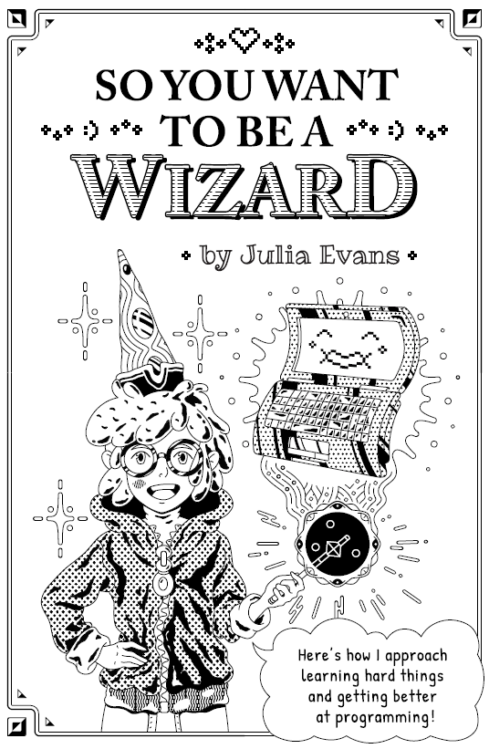

% Social programming
% Programming good research code good
% Patrick Mineault

# Lesson 5

Maybe the real good code is the friends we made along the way

# Lesson 5

Work with better people than you

# Reality check

* People think that programming is a solitary activity
* Reality: at a place like Google, programming is very social
    * readability
    * code reviews
    * design reviews
    * pair programming
    * reading groups
    * retreats
    * performance reviews

# Practical tips

* Open an issue in an open source project
* Open a PR in an open source project
* Set up pair programming with people in your lab
* Set up a review circle

# It doesn't have to be lonely

- Maybe you're the best coder in your lab so you don't have opportunities for growth
- Contribute to open source projects
    - [NMA](https://neuromatchacademy.org/) & [NMC](https://neuromatch.io/) are always happy to have more people!
- Join a community or hackerspace
    - [BrainHack.org](https://brainhack.org/)
    - Meetup
    - [Hackerspaces](https://wiki.hackerspaces.org/w/index.php)
    - [PyLadies](https://www.pyladies.com/)

# Become a wized!

{height=220px}

# Wizard!

- Great zine about how to become a wizard from [Julia Evans](https://www.twitter.com/b0rk)
- [Zine link](https://wizardzines.com/comics/take-on-hard-projects/)

# You can accomplish anything!

# Lesson 5

* Work with better people than you
* It's a bit of a stretch to make this work with the theme of WM & LTM
    * The most important point: grow with people
* Your 5-minute exercise: schedule one pair-programming session