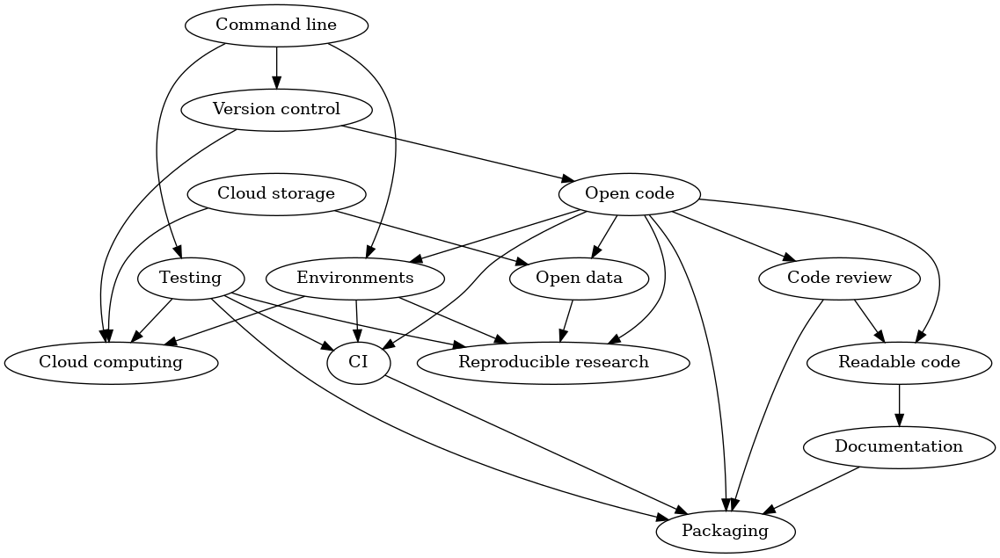

% Improving your skillset
% Good research code
% Patrick Mineault

# Lesson 5

Maybe the real good code is the friends we made along the way

# Lesson 5

Work with better people than you

# Reality check

* People think that programming is a solitary activity
* Reality: at a place like Google, programming is very social
    * readability
    * code reviews
    * design reviews
    * pair programming
    * reading groups
    * retreats
    * performance reviews

# Open discussion

Q: what is pair programming?

# Pair programming

* Pair programming is a way for two programmers, potentially of different skill leves, to share knowledge through active practice
* Traditional style: driver and navigator
    * The driver physically types the code into the terminal/editor. They think about the micro-issues (e.g. what goes in the body of the for loop)
    * The navigator tells the driver what to write. They typically focus about macro-issues (e.g. what should a function accomplish, how is it architected)

# What you learn through pair programming

* You practice your communication skills
* You learn someone's productivity shortcuts. E.g. I learned about Ctrl+Shift+R (search in bash) through a pair programming session.
* If someone has domain knowledge (e.g. neuroscience) and the other technical knowledge (e.g. Python), you will make faster progress than two people working separately

# Tips on pair programming

* Tools can make remote pair programming more comfortable
  * Zoom screensharing (can lead to embarassment if e.g. you accidentally Alt-Tab to an ebay search for beanie babies)

# Practical tips

* Open an issue in an open source project
* Open a PR in an open source project
* Set up pair programming with people in your lab or study group
    * One person drives, one person co-pilots
    * Learn how at NMA2021!
    * [CoCalc](https://cocalc.com/) and [DeepNote](https://deepnote.com/) can do this remotely.
* Set up study group with fellow programmers ([event suggestions from Mozilla](http://mozillascience.github.io/studyGroupHandbook/event-types.html)).

# Set up a review circle

[You can use Github Pull Requests to give and receive line-by-line feedback on code](https://docs.github.com/en/enterprise-server@2.20/github/collaborating-with-issues-and-pull-requests/reviewing-proposed-changes-in-a-pull-request).

# It doesn't have to be lonely

- Maybe you're the best coder in your lab so you don't have opportunities for growth
- Contribute to open source projects
    - [NMA](https://neuromatchacademy.org/) & [NMC](https://neuromatch.io/) are always happy to have more people!
- Join a community or hackerspace
    - [BrainHack.org](https://brainhack.org/)
    - Meetup
    - [Hackerspaces](https://wiki.hackerspaces.org/w/index.php)
    - [PyLadies](https://www.pyladies.com/)

# Become a wizard!

{height=220px}

# Wizard!

- Great zine about how to become a wizard from [Julia Evans](https://www.twitter.com/b0rk)
- [Zine link](https://wizardzines.com/comics/take-on-hard-projects/)

# You are never finished learning!

# Acknowledgement

Thanks to the reviewers, Tyler Sloan and Elizabeth DuPre who made this talk much better.

# You can accomplish anything!

# Lesson 5

* Work with better people than you
* It's a bit of a stretch to make this work with the theme of WM & LTM
    * The most important point: grow with people
* Your 5-minute exercise: schedule one pair-programming session
